# BDHRP — Full Database Diagram

> Designed for the Laravel backend at `D:\herd\jeffre2\jefferi-backend`
> Covers every page and feature found at **https://bdhrp.vercel.app/**

---

## 📌 Site Feature Map → Database Coverage

| Page / Feature | Tables |
|---|---|
| Home | `news_articles`, `gallery_items`, `topics` |
| News `/news/:id` | `news_articles`, `news_categories`, `article_tags`, `news_tags` |
| Gallery `/gallery` | `gallery_items`, `gallery_albums` |
| About Us `/about-us` | `pages` (CMS), `people` |
| Our Committees `/our-committees` | `committees`, `divisions` |
| Committee `/committee/:division` | `committees`, `committee_members`, `committee_events`, `newsletter_subscriptions` |
| Activities `/activities` | `activities` |
| Legacies `/legacies` | `legacies` |
| Newsletters `/newsletters` | `newsletter_issues`, `newsletter_subscriptions` |
| Careers `/careers` | `careers`, `career_applications` |
| People `/people` | `people`, `people_roles` |
| Social Media `/social-media` | `social_media_links` |
| HR Education `/hr-education` | `pages` (CMS) |
| Partners `/partners` | `partners` |
| Financials `/financials` | `financial_reports` |
| Accessibility `/accessibility` | `pages` (CMS) |
| Contact `/contact` | `contact_submissions` |
| Donate Now `/donate-now` | `donations`, `donors` |
| District `/district/:name` | `districts` |
| Topic `/topic/:slug` | `topics`, `article_tags` |
| Admin / CMS | `users`, `roles`, `permissions`, `role_user`, `media`, `settings` |

---

## 🗄️ Full Entity Relationship Diagram

```mermaid
erDiagram

    %% ─────────────────────────────────────────
    %% USERS & AUTH (CMS Admin)
    %% ─────────────────────────────────────────
    users {
        bigint id PK
        string name
        string email
        string password
        string avatar
        boolean is_active
        timestamp email_verified_at
        timestamp last_login_at
        timestamp created_at
        timestamp updated_at
    }

    roles {
        bigint id PK
        string name
        string slug
        string description
        timestamp created_at
    }

    permissions {
        bigint id PK
        string name
        string slug
        string module
        timestamp created_at
    }

    role_user {
        bigint id PK
        bigint user_id FK
        bigint role_id FK
    }

    role_permissions {
        bigint id PK
        bigint role_id FK
        bigint permission_id FK
    }

    users ||--o{ role_user : "has"
    roles ||--o{ role_user : "assigned to"
    roles ||--o{ role_permissions : "has"
    permissions ||--o{ role_permissions : "belongs to"

    %% ─────────────────────────────────────────
    %% NEWS / BLOG
    %% ─────────────────────────────────────────
    news_categories {
        bigint id PK
        string name
        string slug
        string description
        string color
        boolean is_active
        int sort_order
        timestamp created_at
        timestamp updated_at
    }

    news_articles {
        bigint id PK
        bigint category_id FK
        bigint author_id FK
        string title
        string slug
        text excerpt
        longtext content
        string featured_image
        string image_caption
        string status
        integer read_time_minutes
        boolean is_featured
        boolean is_breaking
        timestamp published_at
        timestamp created_at
        timestamp updated_at
        timestamp deleted_at
    }

    news_tags {
        bigint id PK
        string name
        string slug
        timestamp created_at
    }

    article_tags {
        bigint id PK
        bigint article_id FK
        bigint tag_id FK
    }

    news_categories ||--o{ news_articles : "categorizes"
    users ||--o{ news_articles : "authors"
    news_articles ||--o{ article_tags : "has"
    news_tags ||--o{ article_tags : "tagged in"

    %% ─────────────────────────────────────────
    %% COMMITTEES & DIVISIONS (/our-committees, /committee/:division)
    %% ─────────────────────────────────────────
    divisions {
        bigint id PK
        string name
        string slug
        string region
        string country
        string description
        string hero_image
        string email
        string facebook_url
        string instagram_url
        boolean is_active
        int sort_order
        timestamp created_at
        timestamp updated_at
    }

    committees {
        bigint id PK
        bigint division_id FK
        string name
        string slug
        string about
        string location
        string hero_image
        string contact_email
        string facebook_url
        string instagram_url
        boolean is_active
        timestamp created_at
        timestamp updated_at
    }

    committee_members {
        bigint id PK
        bigint committee_id FK
        string name
        string role
        string bio
        string photo
        string email
        boolean is_lead
        int sort_order
        timestamp created_at
        timestamp updated_at
    }

    committee_events {
        bigint id PK
        bigint committee_id FK
        string title
        string slug
        text excerpt
        longtext description
        string image
        date event_date
        string location
        boolean is_published
        timestamp created_at
        timestamp updated_at
    }

    divisions ||--o{ committees : "has"
    committees ||--o{ committee_members : "has"
    committees ||--o{ committee_events : "organizes"

    %% ─────────────────────────────────────────
    %% ACTIVITIES (/activities)
    %% ─────────────────────────────────────────
    activities {
        bigint id PK
        bigint committee_id FK
        string title
        string slug
        text description
        string image
        string type
        date activity_date
        string location
        boolean is_published
        timestamp created_at
        timestamp updated_at
    }

    committees ||--o{ activities : "organizes"

    %% ─────────────────────────────────────────
    %% TOPICS (/topic/:slug) — subject areas
    %% ─────────────────────────────────────────
    topics {
        bigint id PK
        string name
        string slug
        text description
        string hero_image
        string color
        boolean is_active
        int sort_order
        timestamp created_at
        timestamp updated_at
    }

    article_topics {
        bigint id PK
        bigint article_id FK
        bigint topic_id FK
    }

    topics ||--o{ article_topics : "covers"
    news_articles ||--o{ article_topics : "belongs to"

    %% ─────────────────────────────────────────
    %% DISTRICTS (/district/:name)
    %% ─────────────────────────────────────────
    districts {
        bigint id PK
        bigint division_id FK
        string name
        string slug
        string description
        string image
        string contact_email
        boolean is_active
        timestamp created_at
        timestamp updated_at
    }

    divisions ||--o{ districts : "contains"

    %% ─────────────────────────────────────────
    %% GALLERY (/gallery)
    %% ─────────────────────────────────────────
    gallery_albums {
        bigint id PK
        string title
        string slug
        text description
        string cover_image
        boolean is_published
        int sort_order
        timestamp created_at
        timestamp updated_at
    }

    gallery_items {
        bigint id PK
        bigint album_id FK
        string title
        text caption
        string image_path
        string thumbnail_path
        string type
        int sort_order
        boolean is_published
        timestamp created_at
        timestamp updated_at
    }

    gallery_albums ||--o{ gallery_items : "contains"

    %% ─────────────────────────────────────────
    %% PEOPLE (/people)
    %% ─────────────────────────────────────────
    people_roles {
        bigint id PK
        string name
        int sort_order
        timestamp created_at
    }

    people {
        bigint id PK
        bigint role_type_id FK
        string name
        string title
        string bio
        string photo
        string email
        string linkedin_url
        string twitter_url
        boolean is_ambassador
        boolean is_active
        int sort_order
        timestamp created_at
        timestamp updated_at
    }

    people_roles ||--o{ people : "classifies"

    %% ─────────────────────────────────────────
    %% PARTNERS (/partners)
    %% ─────────────────────────────────────────
    partners {
        bigint id PK
        string name
        string logo
        string website_url
        text description
        string type
        boolean is_active
        int sort_order
        timestamp created_at
        timestamp updated_at
    }

    %% ─────────────────────────────────────────
    %% NEWSLETTER SUBSCRIPTIONS & ISSUES
    %% ─────────────────────────────────────────
    newsletter_subscriptions {
        bigint id PK
        bigint committee_id FK
        string email
        string first_name
        string last_name
        string status
        string token
        timestamp verified_at
        timestamp unsubscribed_at
        timestamp created_at
        timestamp updated_at
    }

    newsletter_issues {
        bigint id PK
        string title
        string slug
        longtext content
        string pdf_file
        string status
        timestamp sent_at
        timestamp created_at
        timestamp updated_at
    }

    committees ||--o{ newsletter_subscriptions : "receives"

    %% ─────────────────────────────────────────
    %% CAREERS & APPLICATIONS (/careers)
    %% ─────────────────────────────────────────
    careers {
        bigint id PK
        string title
        string slug
        string department
        string location
        string type
        text description
        text requirements
        text benefits
        string status
        date deadline
        timestamp created_at
        timestamp updated_at
    }

    career_applications {
        bigint id PK
        bigint career_id FK
        string full_name
        string email
        string phone
        string resume_file
        string cover_letter_file
        text message
        string status
        timestamp created_at
        timestamp updated_at
    }

    careers ||--o{ career_applications : "receives"

    %% ─────────────────────────────────────────
    %% DONATIONS (/donate-now)
    %% ─────────────────────────────────────────
    donors {
        bigint id PK
        string first_name
        string last_name
        string email
        string phone
        string country
        string address
        boolean is_anonymous
        timestamp created_at
        timestamp updated_at
    }

    donations {
        bigint id PK
        bigint donor_id FK
        decimal amount
        string currency
        string payment_method
        string transaction_id
        string gateway
        string status
        string type
        string campaign
        text notes
        timestamp donated_at
        timestamp created_at
        timestamp updated_at
    }

    donors ||--o{ donations : "makes"

    %% ─────────────────────────────────────────
    %% LEGACIES (/legacies)
    %% ─────────────────────────────────────────
    legacies {
        bigint id PK
        string full_name
        string email
        string phone
        text message
        string type
        string status
        timestamp created_at
        timestamp updated_at
    }

    %% ─────────────────────────────────────────
    %% CONTACT FORM (/contact)
    %% ─────────────────────────────────────────
    contact_submissions {
        bigint id PK
        string full_name
        string email
        string phone
        string subject
        text message
        string status
        string ip_address
        timestamp created_at
        timestamp updated_at
    }

    %% ─────────────────────────────────────────
    %% SOCIAL MEDIA (/social-media)
    %% ─────────────────────────────────────────
    social_media_links {
        bigint id PK
        string platform
        string url
        string handle
        string icon
        boolean is_active
        int sort_order
        timestamp created_at
        timestamp updated_at
    }

    %% ─────────────────────────────────────────
    %% FINANCIAL REPORTS (/financials)
    %% ─────────────────────────────────────────
    financial_reports {
        bigint id PK
        string title
        int year
        string file_path
        text description
        boolean is_published
        timestamp created_at
        timestamp updated_at
    }

    %% ─────────────────────────────────────────
    %% CMS PAGES (About, HR Education, Accessibility, etc.)
    %% ─────────────────────────────────────────
    pages {
        bigint id PK
        bigint author_id FK
        string title
        string slug
        longtext content
        string meta_title
        text meta_description
        string featured_image
        string status
        string page_type
        timestamp published_at
        timestamp created_at
        timestamp updated_at
    }

    users ||--o{ pages : "authors"

    %% ─────────────────────────────────────────
    %% MEDIA LIBRARY (File uploads)
    %% ─────────────────────────────────────────
    media {
        bigint id PK
        bigint uploaded_by FK
        string original_name
        string file_path
        string thumbnail_path
        string mime_type
        bigint file_size
        string disk
        string collection
        string alt_text
        timestamp created_at
        timestamp updated_at
    }

    users ||--o{ media : "uploads"

    %% ─────────────────────────────────────────
    %% SITE SETTINGS (Global CMS config)
    %% ─────────────────────────────────────────
    settings {
        bigint id PK
        string key
        text value
        string type
        string group
        timestamp created_at
        timestamp updated_at
    }
```

---

## 📋 Table Summary

| # | Table | Purpose |
|---|---|---|
| 1 | `users` | Admin/CMS user accounts |
| 2 | `roles` | Admin roles (Super Admin, Editor, etc.) |
| 3 | `permissions` | Module-level permissions |
| 4 | `role_user` | User ↔ Role pivot |
| 5 | `role_permissions` | Role ↔ Permission pivot |
| 6 | `news_categories` | News article categories (Civil Liberties, etc.) |
| 7 | `news_articles` | Blog/news posts with full HTML content |
| 8 | `news_tags` | Tags like Justice, International Law, etc. |
| 9 | `article_tags` | Article ↔ Tag pivot |
| 10 | `topics` | Subject areas — `/topic/:slug` pages |
| 11 | `article_topics` | Article ↔ Topic pivot |
| 12 | `divisions` | Geographic divisions (regions for Parishads) |
| 13 | `committees` | Local committees per division |
| 14 | `committee_members` | Leadership: Co-Chair, Secretary, Treasurer |
| 15 | `committee_events` | Events per committee |
| 16 | `activities` | Organization-wide activities |
| 17 | `districts` | Districts — `/district/:name` pages |
| 18 | `gallery_albums` | Photo album groups |
| 19 | `gallery_items` | Individual photos/videos in gallery |
| 20 | `people_roles` | Board, Staff, Ambassador type |
| 21 | `people` | Team members and ambassadors |
| 22 | `partners` | Partner organizations with logos |
| 23 | `newsletter_subscriptions` | Email subscribers (with committee link) |
| 24 | `newsletter_issues` | Published newsletter editions |
| 25 | `careers` | Job listings |
| 26 | `career_applications` | Applicant submissions |
| 27 | `donors` | Donor profile data |
| 28 | `donations` | Donation transactions |
| 29 | `legacies` | Legacy/planned giving enquiries |
| 30 | `contact_submissions` | Contact form messages |
| 31 | `social_media_links` | Social platforms and handles |
| 32 | `financial_reports` | Annual financial report PDFs |
| 33 | `pages` | CMS content pages (About, Accessibility, etc.) |
| 34 | `media` | Central media/file upload library |
| 35 | `settings` | Global site configuration key-value store |

---

## 🔑 Key Design Notes for Laravel Backend

> These conventions map directly to Laravel + MySQL best practices.

1. **Soft Deletes** — Use `deleted_at` on `news_articles`, `careers`, `people`, `donations`
2. **Slugs** — All public-facing tables need a unique `slug` for SEO-friendly URLs
3. **Status fields** — Use `draft | published | archived` for content, `active | inactive` for lookups
4. **Polymorphic Media** — Consider making `media` polymorphic (`mediable_id`, `mediable_type`) to attach to any model
5. **Settings table** — Use grouped key-value for site config (e.g., `group = "social"`, `key = "facebook_url"`)
6. **Migrations order** —
   - First: `roles`, `permissions`, `users`, `divisions`, `news_categories`, `news_tags`, `topics`, `people_roles`, `gallery_albums`
   - Then: all tables that have FK references to the above

> For the **Donation** system, integrate with a payment gateway (Stripe / SSLCommerz / PayPal). Store only the `transaction_id` and gateway response — never raw card data.

> The `pages` table with `page_type` covers all static CMS pages:
> `about-us`, `hr-education`, `accessibility`, `social-media`, `financials`, `newsletters`, `legacies`, `activities`, `careers`, `people`
